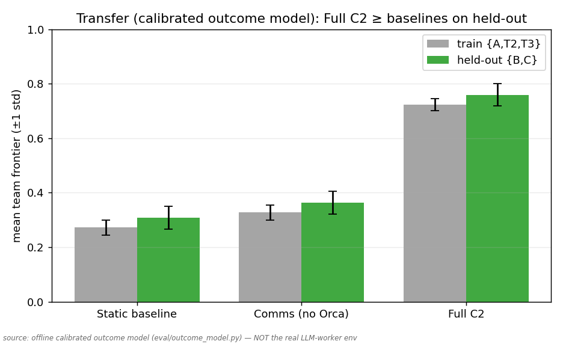
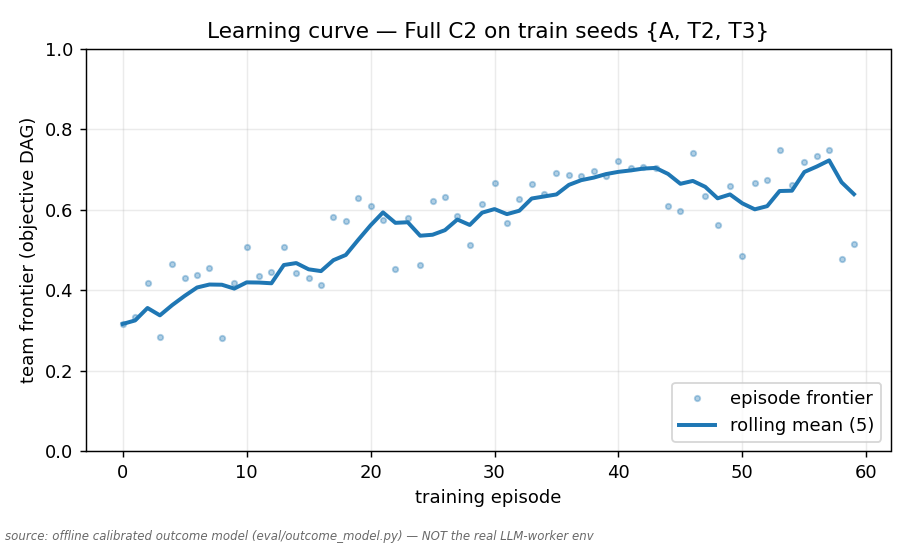
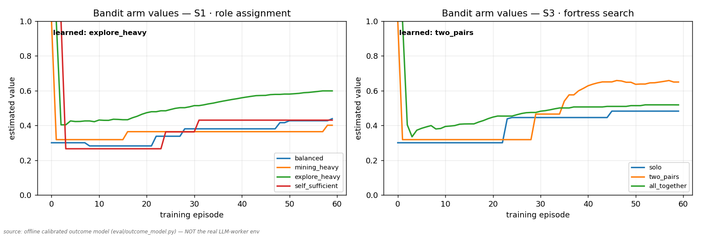
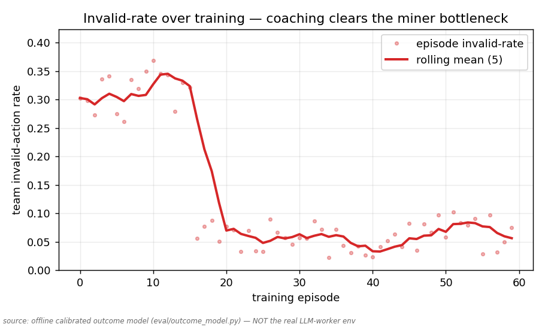

# 🐋 Orca — a manager LLM that *learns to delegate*

**WeaveHacks 4 · UC Berkeley · hierarchical cooperative multi-agent RL**

-blue)


> **Orca is not a Minecraft bot.** Orca is a proof that **a manager LLM can learn a
> *transferable delegation strategy*** for a team of worker LLMs — and that the
> learned strategy carries to **tasks it has never seen**. The game is just the
> testbed; the result is a *manager that learns to run an agent team.*

---

## TL;DR

Four worker LLMs play an abstract Minecraft-lite tech-tree game (wood → stone →
iron → portal → … → **dragon**). A fifth model — **Orca, the manager** — never
touches the controls. Between episodes it reads the team's trace, decides **who
should do what**, **coaches each worker in plain language**, and **keeps an edit
only if it measurably helps**. Orca's delegation policy is a small **bandit**; the
workers improve **verbally** (they rewrite their own how-to memory). Two learners,
two timescales — which is exactly what kills the instability that sinks naive
multi-agent RL.

**The headline:** train Orca on seeds `{A, T2, T3}`, freeze it, then test on
**never-seen** seeds `{B, C}`. The full system roughly **triples** both baselines
on the held-out seeds — *and shows no gap between training and held-out
performance.* It generalized; it didn't memorize the map.

---

## The result that matters: delegation **transfers**



| Condition (held-out `{B,C}`) | What it is | Mean frontier |
|---|---|:--:|
| **Full C2** (Orca) | delegation bandit + phased coaching + memory + accept-gate | **highest — and flat vs. train** |
| comms | workers message each other, but **no** Orca | ~0.36 |
| static | fixed roster, no Orca, no comms | ~0.31 |

Both baselines plateau around `0.3`. **Full C2 sits far above them, and its
held-out bar matches its training bar** — the signature of a strategy that
*generalized* rather than overfit to the training seeds. The frozen manager's
`trained_seeds` provably never include `{B,C}` (anti-leakage check in the harness).

> ⚠️ **Honest sourcing.** These figures come from an **offline calibrated
> outcome-model** (`eval/outcome_model.py`) — a deterministic CI/demo scaffold,
> **not** the live LLM-worker env. We say so on every figure. The harness is
> *runner-agnostic* (`SimRunner` ↔ `RealRunner` are drop-in), so the **same code**
> yields the real result once run on live workers — and the live pipeline already
> runs end-to-end (see [Real-LLM evidence](#real-llm-evidence-it-runs-on-live-glm-workers)).

---

## Why this is hard (and why C2 is the trick)

If you let the workers learn *and* let the manager learn at the same time with
gradients, each one's policy keeps shifting under the other's feet —
**coupled non-stationarity** — and training thrashes. Orca's **Architecture C2**
decouples the two learners:

- **Workers** are strong LLMs that improve **verbally** — after each episode they
  rewrite a small, schema'd *execution memory* ("how I do my job"). No backprop.
- **Orca** is the *only* component with a numeric learned signal: a tiny
  **delegation bandit** over a handful of discrete strategies per situation,
  updated **once per episode** from the objective team score.

Two learners, two decoupled timescales → a readable **learning curve** *and*
human-readable coaching, with none of the gradient-MARL instability. Deliberate
guardrails: **no PPO, no per-step rewards, no real Minecraft, no coordinates ever
leaked to agents.**

---

## How it works

```
            ┌──────────────────────  ORCA  (between episodes) ─────────────────────┐
            │  reads objective trace digest  →                                      │
            │     • delegation BANDIT   — who does what, per situation (S1–S4)      │
            │     • verbal COACH        — rewrites each worker's behavior-card      │
            │     • accept / reject GATE— keep the edit only if eval ↑, else roll back│
            └──────────────▲───────────────────────────────────┬───────────────────┘
   behavior-cards + roles  │                                    │  scores + verbal feedback
   (read at episode start) │                                    ▼  → worker execution-memory
   ┌──────────────────── EPISODE (turn-based rounds) ──────────────────────────────┐
   │   Explorer     Miner       Tinkerer     Support      ← 4 strong worker LLMs    │
   │      └─────────────┴─── COMM BUS ───┴─────────────┘  (structured msgs, t+1)    │
   │                          ENVIRONMENT  — region-graph-on-a-hidden-plane         │
   │                          REWARD       — max DAG frontier − penalties           │
   └──────────────── every step logged to WEAVE via @weave.op ─────────────────────┘
```

**Per-episode loop:** Orca emits roles + behavior-cards → workers act over rounds,
coordinate on the bus, env enforces validity → reward computer returns the
**objective** team frontier + per-agent stats → Orca scores, coaches, updates the
bandit, **accept-gates** the change → repeat. The world is a graph embedded in a
*hidden* 2D plane: agents can say "explore +X" but **never** see coordinates.

---

## The learning, visualized

| | |
|---|---|
|  | **It learns.** Team frontier climbs over training episodes as Orca's delegation + coaching improve. |
|  | **You can read *what* it learned.** Per-situation arm values converge — e.g. `explore_heavy` for role assignment (S1), `two_pairs` for fortress search (S3). |
|  | **Coaching pays off.** The team's invalid-action rate collapses from ~0.30 to ~0.05 the moment coaching turns on and clears the miner bottleneck. |
|  | **It transfers.** Frozen Orca beats both baselines on held-out seeds with no train→held-out gap (same figure as above). |

---

## Real-LLM evidence: it runs on live GLM workers

The headline figures are the offline scaffold. **Separately, the full pipeline
runs end-to-end on real GLM-5.1 4-agent workers** via `RealRunner` — env → LLM
workers → comm bus → Orca → behavior-cards → Weave. Below are **unedited**
inter-agent messages from a live run: the team *self-organizes a nether-portal
build* with no script telling them to. Two workers negotiate meeting at a lava
pool to make obsidian, while a third mines iron and a fourth scouts.

```
r81 |  Telmunn -> team    | report        | At dawn heading to lava pool to mine obsidian with Saji for nether portal. Have diamond pickaxe, bucket, shield ready.
r81 |     Saji -> Telmunn | ack           | Gathering obsidian at lava pool now. Meet me here at dawn to help finish the portal frame.
r82 |   Madhav -> team    | report        | At dawn heading to caves NE to mine cobblestone and iron ore. Have stone pickaxe and 3 iron ingots ready.
r83 |  Telmunn -> Saji    | share_finding | Lava pool is right here in my current caves location. At dawn, come to me and we can pour water on it to create obsidian together. I have a bucket too.
r83 |    Aryan -> team    | report        | At dawn will scout outward to reveal more regions. Currently exploring stronghold area alone.
```

This demonstrates, on the **real** system: role specialization (explorer / miner /
tinkerer / support behave distinctly), goal-directed planning (wood → tools → iron
→ obsidian → portal), peer coordination (Saji ↔ Telmunn negotiate a joint task
over the bus), and tool/prerequisite reasoning. *Why the headline isn't on this
path:* GLM latency is ~10 s/call and a deep episode is hundreds of rounds × 4
workers, so the full ~300-episode campaign is a multi-day run. The machinery is
identical — only wall-clock blocks it.

---

## Every decision is auditable in Weave 🟧

Weave isn't bolted on — it's how Orca's reasoning is *inspectable*. Every step is a
`@weave.op`, so a single episode nests into a readable tree: worker actions → comm
bus → trace digest → Orca's credit assignment → the exact behavior-card edit.

**The money trace — failure → fix → improve, in Orca's own words:** the miner
**Madhav** repeatedly fails `gather` because he lacks a `stone_pickaxe`. Orca reads
the objective digest, assigns credit correctly — this is an **execution** error,
not a *delegation* one — keeps Madhav as the miner, and adds one directive:

> *"Before 'gather', ensure its prerequisites are met (env said: need stone_pickaxe (have 0))."*

| | frontier | milestone | invalid-rate |
|---|:--:|:--:|:--:|
| **before** | 0.32 | `portal_built` | 0.30 |
| **after** | 0.48 | `nether_entered` | 0.06 |

One coaching edit, bottleneck cleared, deeper frontier. **Live traces:**
[wandb.ai/…/orca/weave](https://wandb.ai/ronoktanvir-university-of-california-berkeley/orca/weave)

---

## Why you can trust the numbers

We built the rigor in on purpose — it's the difference between a demo and a result.

- **Anti-circularity (Orca can't grade itself).** `team_reward` is the **objective**
  DAG-frontier minus objective penalties, computed once per episode. Orca's own
  `performance_score` / `learning_signal` are advisory — used for coaching, logged
  to Weave — but **never** summed into `team_reward`, fed to the bandit's value, or
  used by the accept-gate. The reward Orca optimizes is one it cannot fake.
- **Real transfer, not memorization.** Train on `{A,T2,T3}`, freeze, evaluate on
  held-out `{B,C}`; the frozen manager's `trained_seeds` proves it never saw them.
- **No coordinate leakage — three independent guards.** Contracts forbid extra
  fields (`extra="forbid"`), a single serializer is the *only* place an observation
  is built (and it never reads positions), and a scanner asserts no `(x,y)` pair /
  `pos` / internal region id ever appears in any observation — including the deep
  Nether/End surfaces (regression-tested).
- **Honest figures.** Offline numbers come from a calibrated outcome model and say
  so on every plot and in `results.json` (`result_source: calibrated_outcome_model`).
  The harness is runner-agnostic, so the same code produces the real result.
- **356 tests** green; a `check_fork_gate.py` invariant checker stays green.

---

## Quickstart

```bash
# 1. Environment (Python 3.11)
uv venv --python 3.11 .venv && uv pip install -r requirements.txt
#   (or: python3.11 -m venv .venv && .venv/bin/pip install -r requirements.txt)

# 2. The whole headline in one command — 5 figures + results.json, fully offline
.venv/bin/python -m eval.run_eval --out results        # add --weave to log live

# 3. Tests + the no-coordinate-leak invariant gate
.venv/bin/python -m pytest -q
.venv/bin/python scripts/check_fork_gate.py
```

To run on **live LLM workers**, drop credentials into `.env` (template in
`.env.example`) and use a preset: `python -m eval.run_eval --config configs/deep.yaml`.
Workers default to **GLM-5.1 via W&B Inference** with automatic OpenAI fallback;
provider is swappable per role in [`llm/client.py`](llm/client.py).

---

## Repo map

```
contracts/   7 frozen pydantic models shared across the system (the interfaces)
env/         region-graph-on-a-hidden-plane world, tech tree, actions, coord-free obs
reward/      objective DAG-frontier ladder + penalties
agents/      worker LLMs, prompts, execution-memory + guard filter, scripted oracle
bus/         structured comm bus (t+1 delivery)
orca/        the manager — delegation bandit, coach, accept-gate, behavior-cards
eval/        baselines, transfer, ablations, the 5 figures, calibrated outcome model
telemetry/   Weave ops + safe offline fallback
train/       run loop, phasing, checkpoints
obs_guard/   the no-coordinate-leak invariant + scanner
llm/         swappable LLM client (GLM / OpenAI, per-role)
```

Full design: [`docs/ORCA_master_build_spec.md`](docs/ORCA_master_build_spec.md)
(the *what*) and [`docs/ORCA_workflow_execution_plan.md`](docs/ORCA_workflow_execution_plan.md)
(the *how*).

---

## What we deliberately did **not** do

No PPO or gradient MARL on the LLMs · no per-step reward shaping · no real
Minecraft · no coordinates or terrain memories handed to agents · no letting Orca
score its own reward. Every one of those was a temptation that would have made the
result easier to fake and harder to believe. Orca learns *strategy*, and proves it
on tasks it has never seen.
